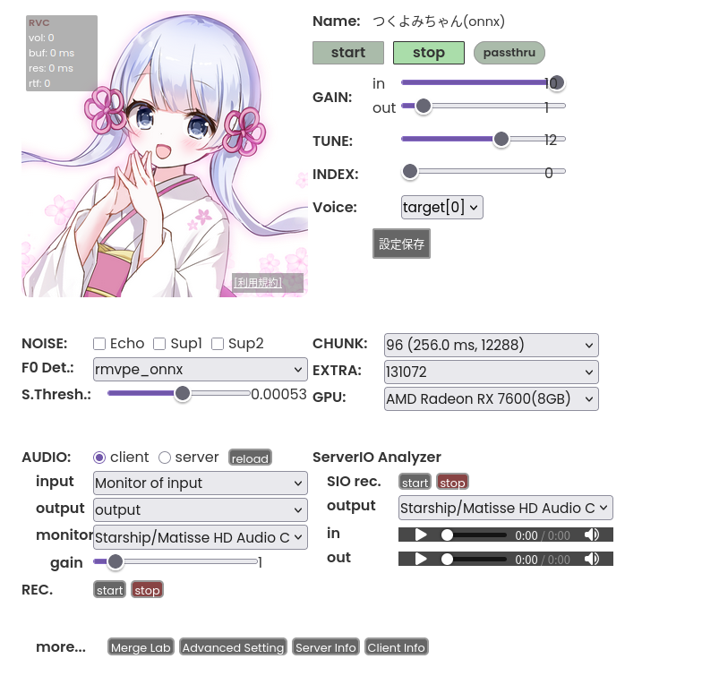

# Linux + AMD GPU 用チュートリアル

## 始め

チュートリアルの更新になります。（2026/03/21時点）

主は依存関係と仮想ケーブルを改訂しました。

依存関係の最適化はしていませんが、アプリを走ることに問題ありません。

**テスト環境：**
- Archlinux（EndeavourOS）
- Radeon RX 7600

## 前提条件

### 関連パッケージ

まず、ROCｍと音声関連のパッケージを入れる。
```bash
sudo pacman -S rocm-hip-sdk rocm-opencl-sdk rocminfo rocm-smi-lib ffmpeg git
```
入れていたはずのパッケージ、全部必須というわけではない。
```bash
$ sudo pacman -Q | rg "rocm|ffm"
ffmpeg 2:8.1-2
rocm-cmake 7.2.0-1
rocm-core 7.2.0-2
rocm-device-libs 2:7.2.0-1
rocm-hip-libraries 7.2.0-1
rocm-hip-runtime 7.2.0-1
rocm-hip-sdk 7.2.0-1
rocm-language-runtime 7.2.0-1
rocm-llvm 2:7.2.0-1
rocm-opencl-runtime 7.2.0-1
rocm-opencl-sdk 7.2.0-1
rocm-smi-lib 7.2.0-1
rocminfo 7.2.0-1
```
user権限設定
```bash
sudo usermod -aG render,video $USER
```
一度ログアウトまたはRebootして、権限設定を反映する。

## 環境設定（conda）
python用の環境を作成する。

```bash
yay -S miniforge
##miniforge初期化
source /opt/miniforge/etc/profile.d/conda.sh
##環境構築
conda create --name rvc python=3.10.20
##環境をアクティブにする
conda activate rvc
```

次はボイスチェンジャー本体のClone
```bash
cd
mkdir software
cd software
git clone https://github.com/w-okada/voice-changer.git
```


## 依存関係のインストール

```bash
cd ~/software/voice-changer/server
pip install "pip<24.1" "setuptools<70" ##互換性維持
pip install torch==2.4.1 torchaudio==2.4.1 --index-url https://download.pytorch.org/whl/rocm6.0
pip install -r requirements-arch-amd.txt
```
長い長いダウンロードの始まり。

〜〜〜

ダウンロード完了。


古いライブラリのセキュリティー設定を変更。Archlinuxの要件に適合する。
```bash
sudo pacman -S patchelf
find $CONDA_PREFIX/lib/ -name "*.so*" -exec patchelf --clear-execstack {} \; 2>/dev/null
```

## 準備完了、アプリを起動する。

```bash
export HSA_OVERRIDE_GFX_VERSION=11.0.2
export LD_LIBRARY_PATH=$CONDA_PREFIX/lib/python3.10/site-packages/torch/lib:$LD_LIBRARY_PATH##互換性維持
python MMVCServerSIO.py --rest_port 18888 --use_gpu
```


http://127.0.0.1:18888/. 
これで、WEB GUI は開けるはず。

メインのフォルダに run-Arch-AMD.sh のスクリプトも入れました、これからそちらも使えます。



## 仮想ケーブルの設定
Linux 標準の PipeWire を使って簡単に作れる。（PulseAudioも）

```bash
pactl load-module module-null-sink sink_name=input sink_properties=device.description="input"
pactl load-module module-null-sink sink_name=output sink_properties=device.description="output"
```
これはRebootまたはログアウトすれば消える設定であるが。
systemctl使えば、永続化設定できる。

```bash
cd
vim ~/.config/systemd/user/virtual-audio.service
[Unit]
Description=Create Virtual Audio Cables (pactl)
# PipeWire-Pulse が起動してから実行するように指定
After=pipewire-pulse.service
Requires=pipewire-pulse.service

[Service]
Type=oneshot
RemainAfterExit=yes
# あなたの環境で動作する pactl コマンドをそのまま記述
ExecStart=/usr/bin/pactl load-module module-null-sink sink_name=input sink_properties=device.description=input
ExecStart=/usr/bin/pactl load-module module-null-sink sink_name=output sink_properties=device.description=output

[Install]
WantedBy=default.target
:wq

systemctl --user daemon-reload
systemctl --user enable --now virtual-audio.service
```
wine 関連の設定はテストできないため、割愛する。

一応、ProtonGe環境のVRchatはそのままでも仮想ケーブルを認認識できる。
